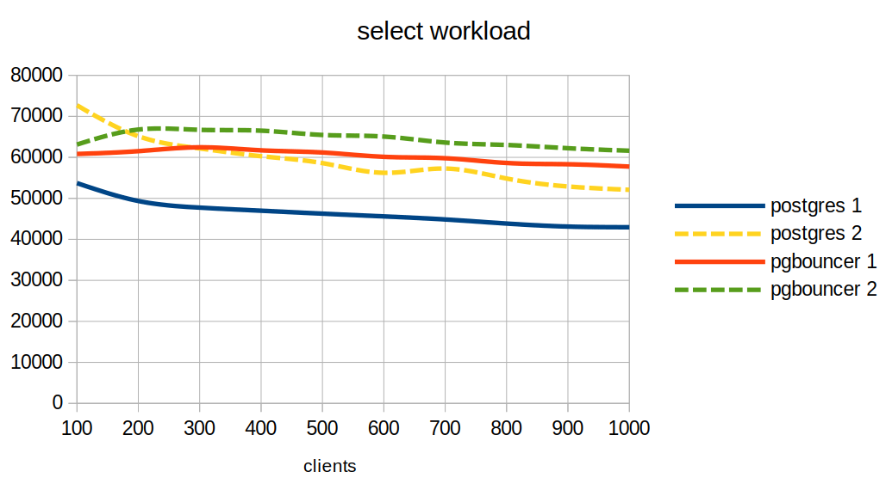
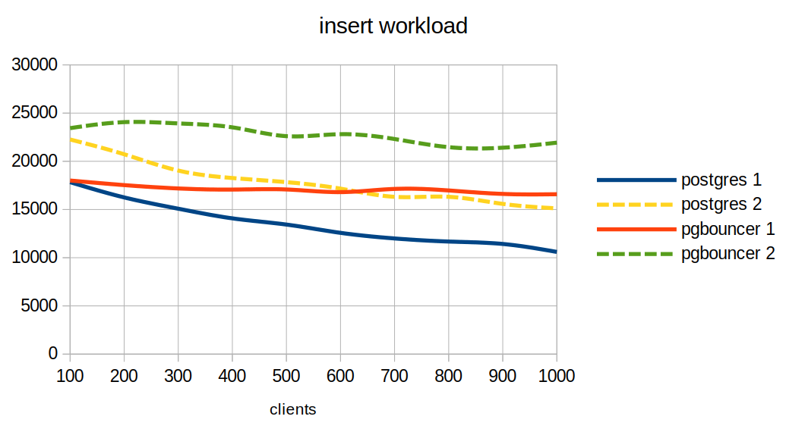
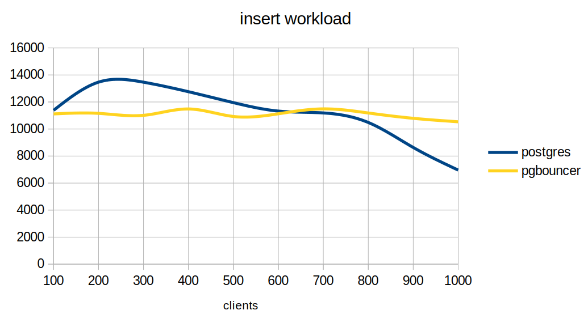

### Сравнение производительности при 500+ коннектах

- ванильный pg
- pgbouncer

### Конфигурация стенда

- виртуальная машина 8 RAM 6 CPU (LXC)
- Debian 12
- PostgreSQL 15.7
- база "тайские перевозки"

### Установка и настройка ПО

Установка ПО, подготовка конфигов, загрузка базы и создание скрипта для теста
```
# apt update && apt upgrade -y && apt install postgresql-15 htop iotop -y

su - postgres

cat /etc/postgresql/15/main/postgresql.conf
...
# IPv4 local connections:
host    all             all             127.0.0.1/32            scram-sha-256
...

cat >> /etc/postgresql/15/main/postgresql.conf << EOL

max_connections = 2000
superuser_reserved_connections = 3
shared_buffers = '4096 MB'
work_mem = '32 MB'
maintenance_work_mem = '320 MB'
huge_pages = off
effective_cache_size = '6 GB'
effective_io_concurrency = 100
random_page_cost = 1.25
shared_preload_libraries = 'pg_stat_statements'
synchronous_commit = on
wal_compression = on
max_worker_processes = 6
max_parallel_workers_per_gather = 3
max_parallel_maintenance_workers = 3
max_parallel_workers = 6
track_wal_io_timing = on
maintenance_io_concurrency = 100
wal_recycle = on
EOL

wget https://storage.googleapis.com/thaibus/thai_small.tar.gz && tar -xf thai_small.tar.gz && psql < thai.sql

cat > ~/workload.sql << EOL

\set r random(1, 5000000) 
SELECT id, fkRide, fio, contact, fkSeat FROM book.tickets WHERE id = :r;
EOL

(as root)     pg_ctlcluster 15 main restart
(as postgres) pg_ctlcluster 15 main stop && pg_ctlcluster 15 main start
```

Установка pgbouncer - сразу после установки postgres владелец конфигов и pgbouncer запущен
```
# apt install pgbouncer -y

# ls -ld /etc/pgbouncer/
drwxr-xr-x 2 root root 4096 Jul 23 19:59 /etc/pgbouncer/

# ls -l /etc/pgbouncer/
total 12
-rw-r----- 1 postgres postgres 9418 Feb  3  2023 pgbouncer.ini
-rw-r----- 1 postgres postgres    0 Feb  3  2023 userlist.txt

# systemctl status pgbouncer
* pgbouncer.service - connection pooler for PostgreSQL
     Loaded: loaded (/lib/systemd/system/pgbouncer.service; enabled; preset: enabled)
     Active: active (running) since Mon 2024-07-22 21:45:03 UTC; 1min 3s ago

# systemctl stop pgbouncer

# mv /etc/pgbouncer/pgbouncer.ini /etc/pgbouncer/pgbouncer.ini.bak

cat > /etc/pgbouncer/pgbouncer.ini << EOF

[databases]
thai = host=localhost port=5432
[users]
[pgbouncer]
logfile = /var/log/postgresql/pgbouncer.log
pidfile = /var/run/postgresql/pgbouncer.pid
listen_addr = localhost
listen_port = 6432
unix_socket_dir = /var/run/postgresql
auth_type = scram-sha-256
auth_file = /etc/pgbouncer/userlist.txt
admin_users = adb
max_client_conn = 2000
default_pool_size = 100
EOF
```

Создание пользователей
```
psql -c "ALTER USER postgres WITH PASSWORD '123';";
psql -c "CREATE USER app WITH PASSWORD '123';";
psql -c "CREATE USER adb WITH PASSWORD '123';";
```

Подготовка файла с пользователями для pgbouncer
```
SELECT concat('"', usename, '" "', passwd, '"') FROM pg_shadow;

$ psql -Atc "SELECT concat('\"', usename, '\" \"', passwd, '\"') FROM pg_shadow ORDER BY 1" > /etc/pgbouncer/userlist.txt
$ cat /etc/pgbouncer/userlist.txt 
"adb" "SCRAM-SHA-256$4096:..."
"app" "SCRAM-SHA-256$4096:..."
"postgres" "SCRAM-SHA-256$4096:..."
```

Создание файла .pgpass для подключения без запроса пароля
```
$ echo "localhost:5432:thai:postgres:123" > ~/.pgpass
$ echo "localhost:6432:thai:postgres:123" >> ~/.pgpass
$ chmod 0600 ~/.pgpass
$ psql -h localhost -d thai
thai=# 
```

### Тесты

Тестовая нагрузка - только чтение, используем параметр -n (do not run VACUUM during initialization)

Подключаемся через сетевой порт 5432 (если не указать - будет через сокет и нерепрезантативно), 4 потока

Процесс pgbouncer работает в один поток и нагружает одно ядро на 100%
```
for i in 100 200 300 400 500 600 700 800 900 1000; do
pgbench -c $i -j 4 -T 10 -f ~/workload.sql -U postgres -h localhost -p 5432 thai -n | grep -E 'clients|tps'
done

number of clients: 100
tps = 53714.741859 (without initial connection time)
number of clients: 200
tps = 49350.933270 (without initial connection time)
number of clients: 300
tps = 47731.477466 (without initial connection time)
number of clients: 400
tps = 46982.526963 (without initial connection time)
number of clients: 500
tps = 46263.990950 (without initial connection time)
number of clients: 600
tps = 45595.114742 (without initial connection time)
number of clients: 700
tps = 44845.845471 (without initial connection time)
number of clients: 800
tps = 43850.958954 (without initial connection time)
number of clients: 900
tps = 43115.059457 (without initial connection time)
number of clients: 1000
tps = 42945.024746 (without initial connection time)
```

Через pgbouncer, порт 6432
```
for i in 100 200 300 400 500 600 700 800 900 1000; do
pgbench -c $i -j 4 -T 10 -f ~/workload.sql -U postgres -h localhost -p 5432 thai -n | grep -E 'clients|tps'
done

number of clients: 100
tps = 60825.931936 (without initial connection time)
number of clients: 200
tps = 61504.974861 (without initial connection time)
number of clients: 300
tps = 62443.701125 (without initial connection time)
number of clients: 400
tps = 61707.082300 (without initial connection time)
number of clients: 500
tps = 61175.169832 (without initial connection time)
number of clients: 600
tps = 60122.921956 (without initial connection time)
number of clients: 700
tps = 59777.284166 (without initial connection time)
number of clients: 800
tps = 58623.670649 (without initial connection time)
number of clients: 900
tps = 58309.536181 (without initial connection time)
number of clients: 1000
tps = 57740.964752 (without initial connection time)
```

Добавим ядер на ВМ - на графике тест (1) 6 ядер и тест (2) 12 ядер HT



Поменяем профиль нагрузки на пишущий
```
cat > ~/workload2.sql << EOL

INSERT INTO book.tickets (fkRide, fio, contact, fkSeat)
VALUES (
	ceil(random()*100)
	, (array(SELECT fam FROM book.fam))[ceil(random()*110)]::text || ' ' ||
    (array(SELECT nam FROM book.nam))[ceil(random()*110)]::text
    ,('{"phone":"+7' || (1000000000::bigint + floor(random()*9000000000)::bigint)::text || '"}')::jsonb
    , ceil(random()*100));
EOL
```

6 ядер - postgres и pgbouncer
```
number of clients: 100
tps = 17836.306645 (without initial connection time)
number of clients: 200
tps = 16253.688428 (without initial connection time)
number of clients: 300
tps = 15081.997149 (without initial connection time)
number of clients: 400
tps = 14082.015154 (without initial connection time)
number of clients: 500
tps = 13436.629289 (without initial connection time)
number of clients: 600
tps = 12578.172259 (without initial connection time)
number of clients: 700
tps = 11996.875563 (without initial connection time)
number of clients: 800
tps = 11676.883480 (without initial connection time)
number of clients: 900
tps = 11424.763330 (without initial connection time)
number of clients: 1000
tps = 10600.441809 (without initial connection time)

number of clients: 100
tps = 18007.471422 (without initial connection time)
number of clients: 200
tps = 17531.471764 (without initial connection time)
number of clients: 300
tps = 17182.137991 (without initial connection time)
number of clients: 400
tps = 17067.289924 (without initial connection time)
number of clients: 500
tps = 17077.048695 (without initial connection time)
number of clients: 600
tps = 16802.995748 (without initial connection time)
number of clients: 700
tps = 17135.012671 (without initial connection time)
number of clients: 800
tps = 16975.393766 (without initial connection time)
number of clients: 900
tps = 16614.596703 (without initial connection time)
number of clients: 1000
tps = 16584.932371 (without initial connection time)
```

12 ядер - postgres и pgbouncer
```
for i in 100 200 300 400 500 600 700 800 900 1000; do
pgbench -c $i -j 4 -T 10 -f ~/workload2.sql -U postgres -h localhost -p 5432 thai 2>/dev/null | grep -E 'clients|tps'
done

number of clients: 100
tps = 22263.621518 (without initial connection time)
number of clients: 200
tps = 20729.587719 (without initial connection time)
number of clients: 300
tps = 19038.872826 (without initial connection time)
number of clients: 400
tps = 18265.640862 (without initial connection time)
number of clients: 500
tps = 17838.437457 (without initial connection time)
number of clients: 600
tps = 17163.598478 (without initial connection time)
number of clients: 700
tps = 16312.605321 (without initial connection time)
number of clients: 800
tps = 16315.676114 (without initial connection time)
number of clients: 900
tps = 15582.840576 (without initial connection time)
number of clients: 1000
tps = 15114.629166 (without initial connection time)

for i in 100 200 300 400 500 600 700 800 900 1000; do
pgbench -c $i -j 4 -T 10 -f ~/workload2.sql -U postgres -h localhost -p 6432 thai 2>/dev/null | grep -E 'clients|tps'
done

number of clients: 100
tps = 23437.566764 (without initial connection time)
number of clients: 200
tps = 24063.730761 (without initial connection time)
number of clients: 300
tps = 23929.051068 (without initial connection time)
number of clients: 400
tps = 23523.410945 (without initial connection time)
number of clients: 500
tps = 22609.048490 (without initial connection time)
number of clients: 600
tps = 22813.177764 (without initial connection time)
number of clients: 700
tps = 22310.776484 (without initial connection time)
number of clients: 800
tps = 21466.613557 (without initial connection time)
number of clients: 900
tps = 21409.975047 (without initial connection time)
number of clients: 1000
tps = 21931.268312 (without initial connection time)
```



Тест по сети - 2 ВМ по 4 ядра для postgres и pgbouncer на одном хосте, pgbench запускается с внешнего клиента в 8 потоков, т.к. при меньшем значении потоков и clients > 800 тест не срабатывает
```
for i in 100 200 300 400 500 600 700 800 900 1000; do
pgbench -c $i -j 8 -T 10 -f ~/workload2.sql -U postgres -h 192.168.1.61 -p 5432 thai -n | grep -E 'clients|tps'; done

number of clients: 100
tps = 11381.585533 (without initial connection time)
number of clients: 200
tps = 13468.283300 (without initial connection time)
number of clients: 300
tps = 13465.873421 (without initial connection time)
number of clients: 400
tps = 12759.586772 (without initial connection time)
number of clients: 500
tps = 11951.530599 (without initial connection time)
number of clients: 600
tps = 11325.808952 (without initial connection time)
number of clients: 700
tps = 11189.974411 (without initial connection time)
number of clients: 800
tps = 10482.313423 (without initial connection time)
number of clients: 900
tps = 8633.727680 (without initial connection time)
number of clients: 1000
tps = 6961.081453 (without initial connection time)

for i in 100 200 300 400 500 600 700 800 900 1000; do
pgbench -c $i -j 8 -T 10 -f ~/workload2.sql -U postgres -h 192.168.1.62 -p 6432 thai -n | grep -E 'clients|tps'; done

number of clients: 100
tps = 11115.485107 (without initial connection time)
number of clients: 200
tps = 11157.125380 (without initial connection time)
number of clients: 300
tps = 11012.505714 (without initial connection time)
number of clients: 400
tps = 11482.237403 (without initial connection time)
number of clients: 500
tps = 10927.617553 (without initial connection time)
number of clients: 600
tps = 11126.017955 (without initial connection time)
number of clients: 700
tps = 11488.386806 (without initial connection time)
number of clients: 800
tps = 11184.431975 (without initial connection time)
number of clients: 900
tps = 10791.184931 (without initial connection time)
number of clients: 1000
tps = 10534.931945 (without initial connection time)
```



### Консоль pgbouncer

```
$ psql -h localhost -d pgbouncer -p 6432 -U adb
Password for user adb: 
psql (15.7 (Debian 15.7-0+deb12u1), server 1.18.0/bouncer)
WARNING: psql major version 15, server major version 1.18.
         Some psql features might not work.
Type "help" for help.

pgbouncer=# show help;
NOTICE:  Console usage
DETAIL:  
	SHOW HELP|CONFIG|DATABASES|POOLS|CLIENTS|SERVERS|USERS|VERSION
	SHOW FDS|SOCKETS|ACTIVE_SOCKETS|LISTS|MEM
	SHOW DNS_HOSTS|DNS_ZONES
	SHOW STATS|STATS_TOTALS|STATS_AVERAGES|TOTALS
	SET key = arg
	RELOAD
	PAUSE [<db>]
	RESUME [<db>]
	DISABLE <db>
	ENABLE <db>
	RECONNECT [<db>]
	KILL <db>
	SUSPEND
	SHUTDOWN
	WAIT_CLOSE [<db>]
```

### Настройка ulimit для pgbouncer

Тест pgbench зависает после 900 подключений - не хватает доступных файлов

```
cat /var/log/postgresql/pgbouncer.log
ERROR accept() failed: Too many open files

ps -e | grep pgbouncer
  13005 ?        00:00:56 pgbouncer


grep files /proc/13005/limits
Max open files            1024                 524288               files     
```

Добавим настройку в юнит
```
systemctl edit pgbouncer

[Service]
LimitNOFILE=8192

systemctl restart pgbouncer
```
```
ps -e | grep pgbouncer
  13194 ?        00:00:00 pgbouncer

grep files /proc/13194/limits
Max open files            8192                 8192                 files     
```

### Ссылки

- https://www.pgbouncer.org/config.html
- https://stackoverflow.com/questions/42429112/pgbouncer-error-accept-failed-too-many-open-files


