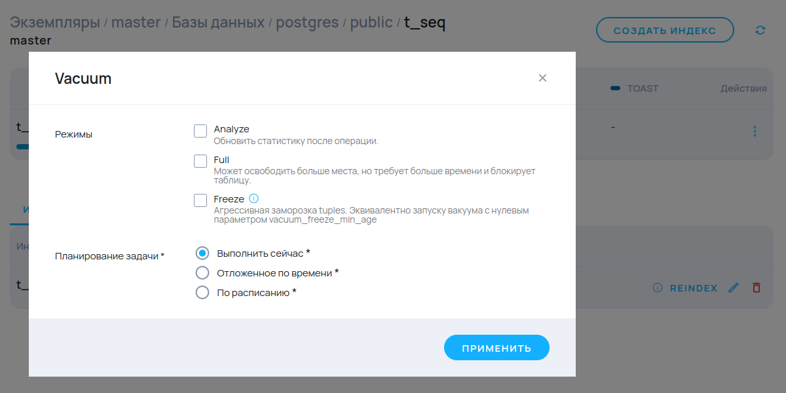

# Системы мониторинга на примере PPEM

Стенд

- Debian 12

- CPU 2, RAM 4, HDD 32

## Установка сервера

Для репозитория рекомендуется любая редакция СУБД Postgres Pro, для тестов будем использовать PostgreSQL 15 из Debian
```
wget https://repo.postgrespro.ru/ppem/ppem/keys/pgpro-repo-add.sh

sh pgpro-repo-add.sh

apt update
apt upgrade
apt install pgpro-manager
apt install postgresql-15
```

## Настройка сервера

Такой pg_hba.conf не рекомендуется в производственной эксплуатации
```
-
#local   all             postgres                               peer
+
# "local" is for Unix domain socket connections only
local   all             all                                     trust
# IPv4 local connections:
host    all             all             127.0.0.1/32            trust
host    all             all             127.0.0.1/32            trust
```

Инициализация репозитория
```
# init-pgpro-manager-repo --conf /etc/pgpro-manager.conf
repo user: pgpro_manager
Error: cannot connect admdb: connection to server on socket "/tmp/.s.PGSQL.5432" failed: No such file or directory
        Is the server running locally and accepting connections on that socket?
```

Найдем сокет в postgresql.conf и укажем в pgpro-manager.conf
```
unix_socket_directories = '/var/run/postgresql'

host = /var/run/postgresql
```
Снова ошибка
```
# init-pgpro-manager-repo --conf /etc/pgpro-manager.conf
repo user: pgpro_manager
Create user: pgpro_manager
+ user pgpro_manager created
Create database: pgpro_manager_repo owner pgpro_manager
+ database created
Upload sql from file: /usr/share/pgpro-manager/sql/init_repo.sql
Traceback (most recent call last):
  File "/usr/bin/init-pgpro-manager-repo", line 33, in <module>
    sys.exit(load_entry_point('ee-manager==1.4.0', 'console_scripts', 'init-pgpro-manager-repo')())
             ^^^^^^^^^^^^^^^^^^^^^^^^^^^^^^^^^^^^^^^^^^^^^^^^^^^^^^^^^^^^^^^^^^^^^^^^^^^^^^^^^^^^^
  File "/usr/lib/python3/dist-packages/ee_manager/lib/init_repo.py", line 424, in main
    insert_sql_file(repoconn, schema_file)
  File "/usr/lib/python3/dist-packages/ee_manager/lib/init_repo.py", line 283, in insert_sql_file
    cur.execute(sql)
UnicodeEncodeError: 'ascii' codec can't encode characters in position 4588-4593: ordinal not in range(128)
```
Посмотрим кодировку
```
postgres=# \l
                                                    List of databases
        Name        |     Owner     | Encoding  | Collate | Ctype | ICU Locale | Locale Provider |   Access privileges   
--------------------+---------------+-----------+---------+-------+------------+-----------------+-----------------------
 pgpro_manager_repo | pgpro_manager | SQL_ASCII | C       | C     |            | libc            | 
 postgres           | postgres      | SQL_ASCII | C       | C     |            | libc            | 
 template0          | postgres      | SQL_ASCII | C       | C     |            | libc            | =c/postgres          +
                    |               |           |         |       |            |                 | postgres=CTc/postgres
 template1          | postgres      | SQL_ASCII | C       | C     |            | libc            | =c/postgres          +
                    |               |           |         |       |            |                 | postgres=CTc/postgres

update pg_database set encoding = pg_char_to_encoding('UTF8') where datname = 'template0';
update pg_database set encoding = pg_char_to_encoding('UTF8') where datname = 'template1';
update pg_database set encoding = pg_char_to_encoding('UTF8') where datname = 'postgres';
drop database pgpro_manager_repo;

postgres=# \l
                                                   List of databases
        Name        |     Owner     | Encoding | Collate | Ctype | ICU Locale | Locale Provider |   Access privileges   
--------------------+---------------+----------+---------+-------+------------+-----------------+-----------------------
 postgres           | postgres      | UTF8     | C       | C     |            | libc            | 
 template0          | postgres      | UTF8     | C       | C     |            | libc            | =c/postgres          +
                    |               |          |         |       |            |                 | postgres=CTc/postgres
 template1          | postgres      | UTF8     | C       | C     |            | libc            | =c/postgres          +
                    |               |          |         |       |            |                 | postgres=CTc/postgres
```
Теперь всё работает
```
# init-pgpro-manager-repo --conf /etc/pgpro-manager.conf
repo user: pgpro_manager
Create user: pgpro_manager
* user pgpro_manager already exists
Create database: pgpro_manager_repo owner pgpro_manager
+ database created
Upload sql from file: /usr/share/pgpro-manager/sql/init_repo.sql
+ sql  loaded
Add information about repository instance
Set migration level to: 1405
+ migration level set

systemctl restart pgpro-manager
```
Web-интерфейс PPEM http://ppem:8877

Логин и пароль admin/admin

## Установка и настройка агента на целевом сервере

```
wget https://repo.postgrespro.ru/ppem/ppem/keys/pgpro-repo-add.sh

sh pgpro-repo-add.sh

apt -y update
apt -y upgrade
apt -y install pgpro-manager-agent
```
На сервере PPEM зайти в "Настройки-Настройки агентов-Добавить агент" и добавить агент

После добавления скопировать ключ и добавить адрес сервера PPEM в настройки агента на целевом сервере /etc/pgpro-manager-agent.conf

Затем перезапустить службу pgpro-manager-agent на целевом сервере

Через меню "Экземпляр-Добавить экземпляр" добавить экземпляр с обнаружением, нужно указать пароль пользователя postgres

## Некоторые возможности интерфейса

Отображается показатель Bloat


DDL и параметры индекса


Запуск вакуума с параметрами



Редактирование последовательности


Файлы таблицы


