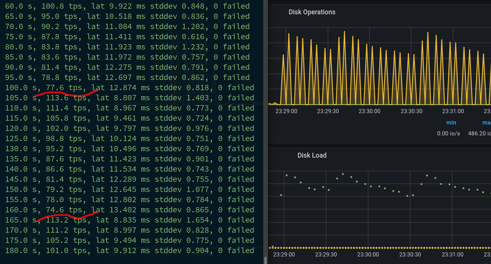
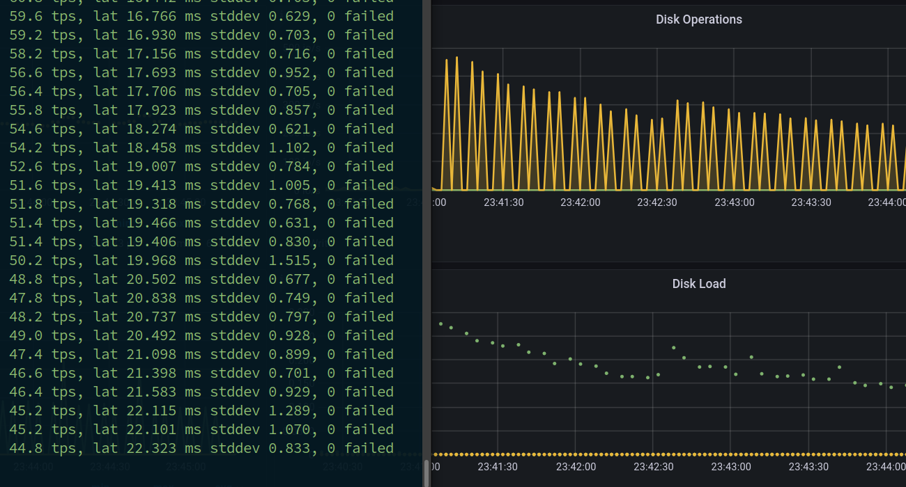
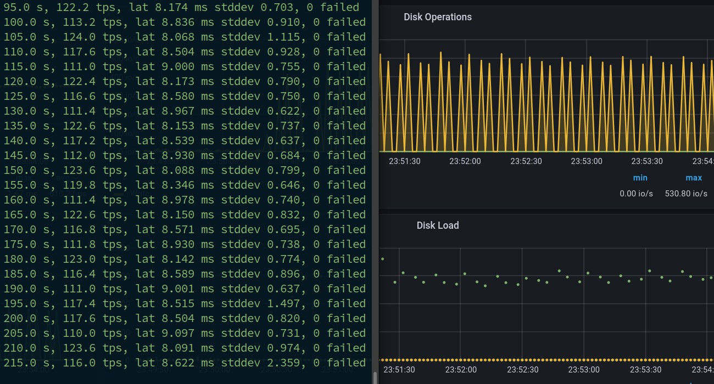

# Особенности работы Vacuum

## Стенд

- VM Debian 12 
- PostgreSQL 16
- Percona Monitoring and Management

Создадим таблицу и нагрузку DELETE и INSERT (размеры подбираются по месту)

Параллельно будем отслеживать срабатывание автовакуума
```
CREATE TABLE t (u uuid);
TRUNCATE TABLE t;
INSERT INTO t SELECT gen_random_uuid() FROM generate_series(1,50000);

cat > write.sql <<EOF
DELETE FROM t WHERE u IN (SELECT u FROM t LIMIT 100);
INSERT INTO t SELECT gen_random_uuid() FROM generate_series(1,100);
--UPDATE t SET u = gen_random_uuid() WHERE u IN (SELECT u FROM t LIMIT 1);
--INSERT INTO t VALUES (gen_random_uuid());
EOF

pgbench -c 1 -j 4 -T 300 -f ~/write.sql -U postgres -n -P 5

watch -n 5 'psql -c "SELECT relname, last_vacuum, last_autovacuum FROM pg_stat_user_tables"'
```

Параметры по умолчанию
```
               Parameter               |   Value   
---------------------------------------+-----------
 autovacuum                            | on
 autovacuum_analyze_scale_factor       | 0.1
 autovacuum_analyze_threshold          | 50
 autovacuum_freeze_max_age             | 200000000
 autovacuum_max_workers                | 3
 autovacuum_multixact_freeze_max_age   | 400000000
 autovacuum_naptime                    | 1min
 autovacuum_vacuum_cost_delay          | 2ms
 autovacuum_vacuum_cost_limit          | -1
 autovacuum_vacuum_insert_scale_factor | 0.2
 autovacuum_vacuum_insert_threshold    | 1000
 autovacuum_vacuum_scale_factor        | 0.2
 autovacuum_vacuum_threshold           | 50
 autovacuum_work_mem                   | -1
```

Заметна просадка скорости дисковых операций и падение TPS со 115 до 75 с периодом 1 минута



Попробуем добиться более равномерной загрузки дисковой системы через настройки автовакуума

Для этого он должен запускаться чаще и обрабатывать меньше строк

Сперва рассмотрим противоположный случай и установим высокие границы для изменных строк 

```
ALTER TABLE t SET (
autovacuum_vacuum_threshold = 25000,
autovacuum_analyze_threshold = 25000,
autovacuum_vacuum_insert_threshold = 25000,
autovacuum_vacuum_scale_factor = 50,
autovacuum_analyze_scale_factor = 50,
autovacuum_vacuum_insert_scale_factor = 50
);
```

Скорость стабильно падает, автовакуум не запускается



Теперь уменьшим границы изменных строк и увеличим частоту запуска автовакуума

```
ALTER TABLE t RESET (
autovacuum_vacuum_threshold,
autovacuum_analyze_threshold,
autovacuum_vacuum_insert_threshold,
autovacuum_vacuum_scale_factor,
autovacuum_analyze_scale_factor,
autovacuum_vacuum_insert_scale_factor
);

ALTER TABLE t SET (
autovacuum_vacuum_threshold = 100,
autovacuum_analyze_threshold = 100,
autovacuum_vacuum_insert_threshold = 100,
autovacuum_vacuum_scale_factor = 0.01,
autovacuum_analyze_scale_factor = 0.01,
autovacuum_vacuum_insert_scale_factor = 0.01
);

alter system set autovacuum_max_workers = 4;
alter system set autovacuum_naptime = 15;
restart
```

Загрузка диска и TPS стабилизировались, автовакуум работает



Ссылки:
- https://www.postgresql.org/docs/current/runtime-config-autovacuum.html
- https://klotzandrew.com/blog/posgres-per-table-autovacuum-management/